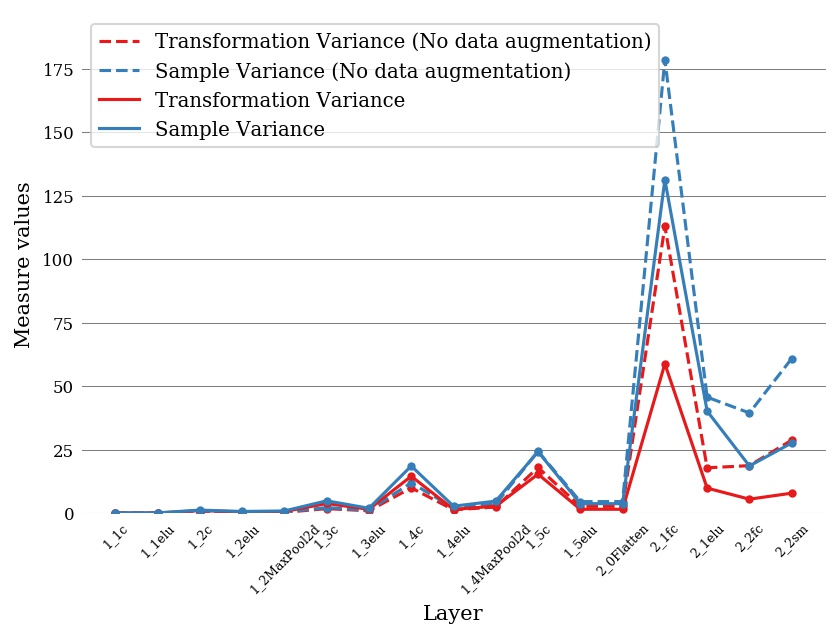

# Transformational Measures 

The Transformational Measures (TM) library allows neural network designers to evaluate the invariance, equivariance and other properties of their models with respect to a set of transformations. Support for Pytorch (current) and Tensorflow/Keras (coming). 

### Visualizations

**Invariance heatmap**: Each column shows the invariance to rotation of a layer of a Neural Network. Each row/block inside each column indicates the invariance of a feature map or single neuron, depending on the layer. 

**Invariance vs layer, same model**: Plot of the transformational and sample invariance to rotations of a simple neural network trained on MNIST, with and without data augmentation. The X axis indicates the layer, while the Y axis shows the average invariance of the layer.

**Invariance vs layer, different models**: Plot of the invariance to rotations of several well-known models trained on CIFAR10. The number of layers of each model is fit on a percentage scale, so that different models can be compared 

# PyTorch API

TODO describe

# TensorFlow API

[In development](https://github.com/midusi/transformational_measures_tf/) 

# Examples

You can find many uses of this library in the [repository with the code](https://github.com/facundoq/variance_measure) for the article [Measuring (in)variances in Convolutional Networks](https://link.springer.com/chapter/10.1007/978-3-030-27713-0_9), where this library was first presented. Also, in the code for the experiments of the PhD Thesis ["Invariance and Same-Equivariance Measures for Convolutional Neural Networks" (spanish)](http://sedici.unlp.edu.ar/handle/10915/90903).

# Citing

If you use this library in your research, we kindly ask you to cite [Measuring (in)variances in Convolutional Networks](https://link.springer.com/chapter/10.1007/978-3-030-27713-0_9)

## Bibtex

    @inproceedings{quiroga2019measuring,
    title={Measuring (in) variances in Convolutional Networks},
    author={Quiroga, Facundo and Torrents-Barrena, Jordina and Lanzarini, Laura and Puig, Domenec},
    booktitle={Conference on Cloud Computing and Big Data},
    pages={98--109},
    year={2019},
    organization={Springer}
    }

