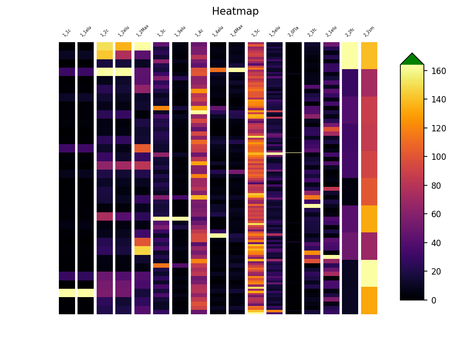
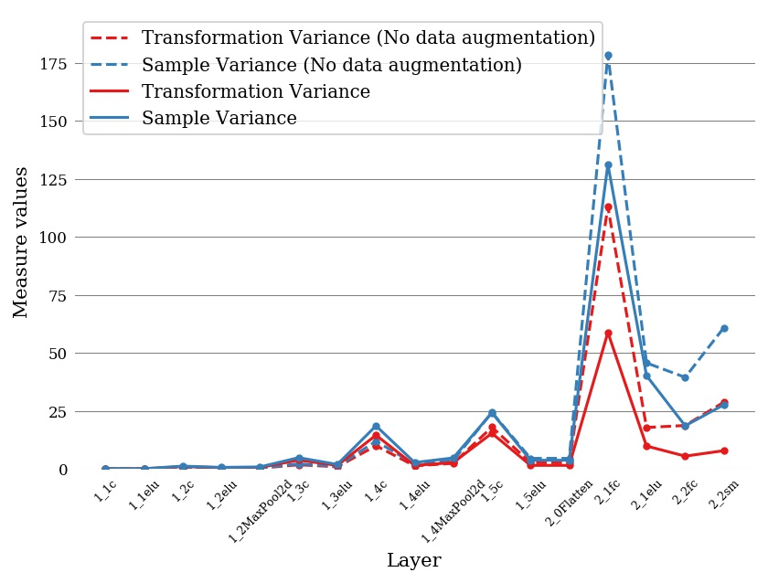
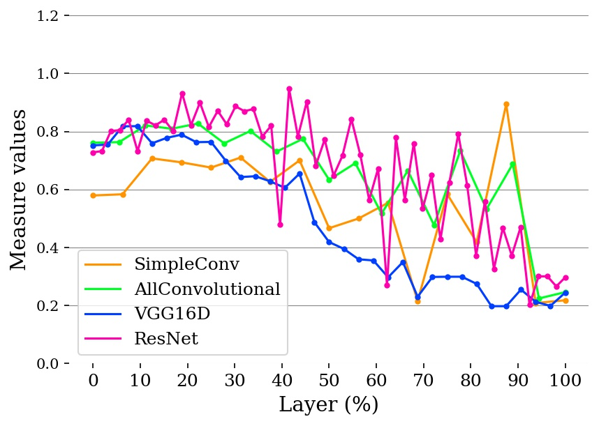

# ✴ Transformational Measures 📏

The Transformational Measures (`tmeasures`) library allows neural network designers to evaluate the invariance, equivariance and other properties of their models with respect to a set of transformations. Support for Pytorch (current) and Tensorflow/Keras (coming). 

## 🔎 Visualizations

`tmeasures` allows computing invariance, same-equivariance and other transformational measures, and contains helpful functions to visualize these. The following are some examples of the results you can obtain with the library:

### 🔥 Invariance heatmap

Each column shows the invariance to rotation of a layer of a Neural Network. Each row/block inside each column indicates the invariance of a feature map or single neuron, depending on the layer. 



### 📉 Average Invariance vs layer, same model

Plot the transformational and sample invariance to rotations of a simple neural network trained on MNIST, with and without data augmentation. The X axis indicates the layer, while the Y axis shows the average invariance of the layer.



### 📈 Average invariance by layer, different models: 

Plot of the invariance to rotations of several well-known models trained on CIFAR10. The number of layers of each model is streched on a percentage scale, so that different models can be compared.



## 💻 PyTorch API


These notebooks contain step-by-step code and explanations to measure invariance in both custom and pretrained model, both using predefined and custom transformations. They can be executed in google colab directly. Alternatively, you can download them for local execution, but be aware you will have to provide your own virtualenv with `torch` and `torchvision`  [installed](https://pytorch.org/get-started/locally/).


* [Measuring invariance to brightness changes on a pretrained ResNet18 on TinyImageNet](https://colab.research.google.com/github/facundoq/transformational_measures/blob/master/docs/examples/ResNet%20Invariance%20with%20TinyImageNet.ipynb)
* [Measuring invariance to rotations on a custom CNN on MNIST](https://colab.research.google.com/github/facundoq/transformational_measures/blob/master/docs/examples/Variance%20to%20rotations%20of%20a%20CNN%20trained%20on%20MNIST%20with%20PyTorch.ipynb)

Other examples with multiple measures and pretrained models can be found in the [doc](/doc) folder of this repository.


## 💻 TensorFlow API

We are still developing the Tensorflow API. 

## 📋 Examples

You can find many uses of this library in the [repository with the code](https://github.com/facundoq/transformational_measures_experiments) for the article [Measuring (in)variances in Convolutional Networks](https://link.springer.com/chapter/10.1007/978-3-030-27713-0_9), where this library was first presented. Also, in the code for the experiments of the PhD Thesis ["Invariance and Same-Equivariance Measures for Convolutional Neural Networks" (spanish)](https://doi.org/10.24215/16666038.20.e06).

## 🤙🏽 Citing

If you use this library in your research, we kindly ask you to cite [ Invariance and Same-Equivariance Measures for Convolutional Neural Networks.](https://doi.org/10.24215/16666038.20.e06)

````
@article{quiroga20,
  author    = {Facundo Quiroga and
               Laura Lanzarini},
  title     = {Invariance and Same-Equivariance Measures for Convolutional Neural Networks},
  journal   = {J. Comput. Sci. Technol.},
  volume    = {20},
  number    = {1},
  pages     = {06},
  year      = {2020},
  url       = {https://doi.org/10.24215/16666038.20.e06},
  doi       = {10.24215/16666038.20.e06},
}
````
